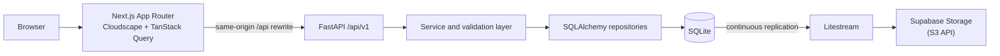
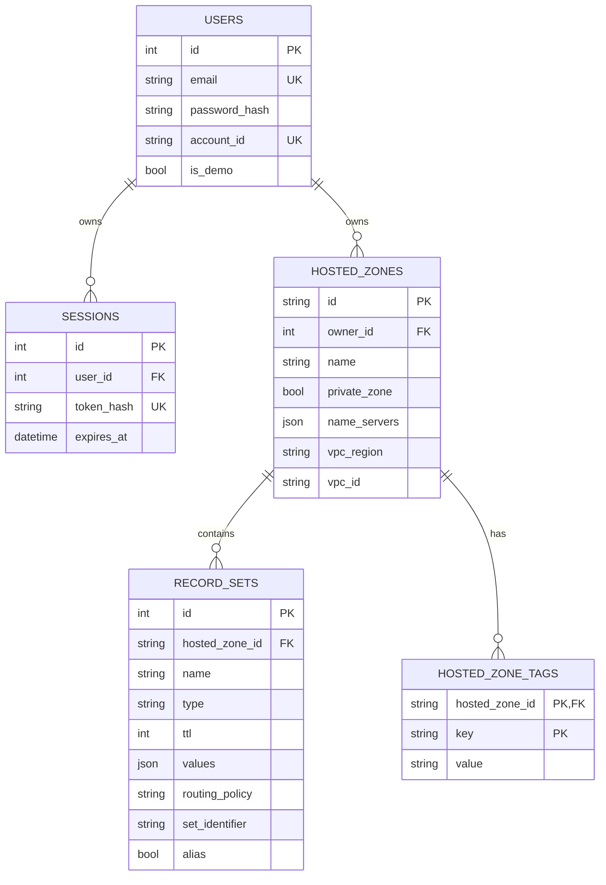

# Route 53 Console Clone

A full-stack clone of the AWS Route 53 management console for hosted zones and
DNS records. It reproduces the console workflows and validation rules; it does
not operate authoritative DNS servers or change real AWS resources.

[](https://github.com/harshisageek/scaler-route53-assignment/actions/workflows/ci.yml)

- Repository: <https://github.com/harshisageek/scaler-route53-assignment>
- Live demo: not currently deployed; use the one-command Docker setup below
- Local API docs: <http://localhost:8000/docs>

## What is included

- Multi-user sign-up, sign-in, sign-out, owner isolation, and a resettable demo account
- Public and private hosted-zone creation, details, editing, deletion, tags, search, sorting, and pagination
- DNS record CRUD for A, AAAA, CNAME, TXT, MX, NS, PTR, SRV, and CAA
- Route 53 rules for apex CNAMEs, conflicting names, protected NS/SOA records, and field-level validation
- Weighted, failover, latency, geolocation, and multivalue routing policies
- Alias records for mocked CloudFront, S3 website, load balancer, API Gateway, and in-zone targets
- Atomic BIND import with preview, plus BIND and JSON export
- Atomic record change batches and multi-select bulk deletion
- AWS Cloudscape shell, help panel, breadcrumbs, table preferences, keyboard shortcuts, and dark mode
- OpenAPI-generated frontend types, coverage gates, axe checks, Playwright in CI, security headers, request IDs, and JSON production logs

## Demo account

Docker Compose reads the safe local values in `backend/.env.example`:

- Email: `demo@route53-clone.dev`
- Password: `change-me-locally`

Choose **Try the demo** on the sign-in screen; no password entry is
required. Demo data is restored when it is older than 24 hours at the next demo
sign-in. A hosted deployment must set its own `DEMO_USER_PASSWORD`.

## Architecture



The browser only talks to Next.js. Next.js forwards `/api/*` to FastAPI, so the
opaque session cookie remains first-party, `HttpOnly`, and `SameSite=Lax`.

### Database



## Quick start with Docker

Requirements: Docker Compose v2. On this machine, start Colima and point Docker
at its socket first:

```sh
export PATH="$HOME/.local/bin:$HOME/.local/dev-env/bin:$HOME/.local/git-env/bin:$PATH"
export DOCKER_HOST="unix://$HOME/.colima/docker.sock"
colima start
docker compose up --build
```

Open <http://localhost:3000>. The API is at <http://localhost:8000>, and its
interactive OpenAPI documentation is at <http://localhost:8000/docs>.

The complete local environment is both Compose services: frontend on port 3000
and backend on port 8000. SQLite data persists in the `backend-data` named
volume. `docker compose down` stops the stack without deleting that volume.

## Run without Docker

Requirements: Python 3.12, [uv](https://docs.astral.sh/uv/), Node.js 24, and
[pnpm](https://pnpm.io/).

```sh
make install

# Terminal 1
cd backend
cp .env.example .env
uv run alembic upgrade head
uv run uvicorn app.main:app --reload

# Terminal 2
cd frontend
cp .env.example .env.local
pnpm dev
```

## Configuration

Real `.env` files are ignored. Commit only the documented example files.

### Backend

| Variable | Example | Purpose |
| --- | --- | --- |
| `APP_ENV` | `development` | `development`, `test`, or `production` |
| `LOG_LEVEL` | `INFO` | Application log level |
| `DATABASE_URL` | `sqlite:///./data/route53.db` | SQLite location |
| `SESSION_COOKIE_NAME` | `r53_session` | Session cookie name |
| `SESSION_TTL_HOURS` | `12` | Session lifetime |
| `SESSION_COOKIE_SECURE` | `false` | Must be `true` in production |
| `CORS_ALLOWED_ORIGINS` | `http://localhost:3000` | Direct-backend local development only |
| `LOGIN_RATE_LIMIT` | `5/minute` | Failed sign-in throttle |
| `MAX_IMPORT_BYTES` | `1048576` | BIND upload limit |
| `SEED_DEMO_DATA` | `true` | Create/reset the shared demo account |
| `DEMO_USER_EMAIL` | `demo@route53-clone.dev` | Demo account email |
| `DEMO_USER_PASSWORD` | local placeholder | Set privately for hosted environments |
| `DEMO_RESET_INTERVAL_HOURS` | `24` | Demo reset age |
| `LITESTREAM_S3_ENDPOINT` | empty locally | Supabase S3 endpoint |
| `LITESTREAM_S3_BUCKET` | empty locally | Backup bucket |
| `LITESTREAM_S3_REGION` | empty locally | Bucket region |
| `LITESTREAM_ACCESS_KEY_ID` | empty locally | S3 access key; secret |
| `LITESTREAM_SECRET_ACCESS_KEY` | empty locally | S3 secret key; secret |

### Frontend

| Variable | Example | Purpose |
| --- | --- | --- |
| `BACKEND_URL` | `http://localhost:8000` | Server-side target for `/api/*` rewrites |
| `NEXT_PUBLIC_APP_ENV` | `development` | Public environment label |

## API overview

All application endpoints are under `/api/v1`. Successful create operations
return `201`; deletes return `204`; conflicts return `409`; invalid data returns
`422`. Every error uses:

```json
{"error":{"code":"ValidationFailed","message":"One or more fields are invalid.","details":{}}}
```

| Area | Endpoints |
| --- | --- |
| Health | `GET /health` |
| Authentication | `POST /auth/sign-up`, `/sign-in`, `/demo`, `/sign-out`; `GET /auth/me` |
| Hosted zones | `GET/POST /hosted-zones`; `GET/PATCH/DELETE /hosted-zones/{id}` |
| Import/export | `POST /hosted-zones/{id}/records/import/preview`, `/import`; `GET /hosted-zones/{id}/export` |
| Records | `GET/POST /hosted-zones/{id}/records`; `GET/PUT/DELETE /hosted-zones/{id}/records/{recordId}` |
| Bulk | `POST /hosted-zones/{id}/records:batch`; `POST /hosted-zones:batch` |

The generated TypeScript declarations are in
`frontend/src/lib/api/schema.d.ts`. Regenerate them with `make api-types`.

## Keyboard shortcuts

| Keys | Action |
| --- | --- |
| `/` | Focus the current table search |
| `c` | Create a hosted zone or record |
| `g`, then `z` | Go to hosted zones |
| `?` | Open the shortcut reference |
| `Esc` | Close the shortcut dialog or help panel |

Shortcuts are ignored while focus is in an input, text area, select, or editable
element.

## Testing and quality gates

```sh
make format       # rewrite Python and TypeScript formatting
make format-check # check formatting without rewriting
make lint         # ruff and ESLint
make typecheck    # strict mypy and TypeScript
make test         # pytest and Vitest with coverage thresholds
make e2e          # Playwright; run the Compose stack first
```

`make test` enforces 95% backend coverage and frontend thresholds of 78%
statements, 75% branches, 70% functions, and 80% lines. CI also builds Next.js
and runs the full Playwright suite, including axe accessibility checks. A
performance test inserts 10,000 records and verifies indexed server-side
pagination remains responsive.

## Requirement traceability

| Requirement | Implementation | Verification |
| --- | --- | --- |
| Route 53-style UI | Cloudscape console shell and feature components | Component tests and Playwright golden paths |
| Hosted-zone lifecycle | `hosted_zones` API, service, repository, and pages | Hosted-zone API/component/e2e tests |
| Public and private zones | VPC-aware create schema and form | Creation API and Playwright tests |
| Record CRUD | `record_sets` layers and record modal/table | Record API/component/e2e tests |
| Nine DNS record types | `services/validation/record_values.py` | Validator unit tests |
| Search, sort, filter, pagination | Server query schemas and indexed repositories | API, component, and 10k-record tests |
| Correct DNS constraints | Domain validators, CNAME rules, protected NS/SOA | Unit and API conflict tests |
| Multi-user security | Argon2, hashed session tokens, owner-scoped queries | Auth and cross-owner isolation tests |
| Import/export bonus | `bind_import.py`, `zone_export.py`, preview/download UI | Parser, round-trip, and Playwright tests |
| Bulk operations bonus | Atomic batch services and multi-select tables | Rollback API tests and Playwright tests |
| Route 53 extras | Tags, routing policies, and alias targets | Unit, API, component, and e2e tests |
| Accessibility and keyboard use | Cloudscape aria labels, shortcuts, axe | Unit and axe Playwright tests |
| Security and operations | Headers, request IDs, JSON logs, health endpoint | Hardening API tests and CI |
| Deployment durability | Render Blueprint and Litestream/Supabase config | Startup script and health workflow |

## Deployment

The repository contains deploy-ready configuration, but no public deployment is
currently attached to it.

1. Import `frontend/` into Vercel and set `BACKEND_URL` to the Render service.
2. Create the Render Blueprint from `render.yaml`.
3. Create a private Supabase Storage bucket with S3 access.
4. Enter the five `LITESTREAM_*` values and a private
   `DEMO_USER_PASSWORD` in Render.
5. Set the GitHub Actions variable `HEALTHCHECK_URL` to the Render
   `/api/v1/health` URL.

Render restores SQLite before migrations, then Litestream continuously
replicates writes. The keep-awake workflow pings health every ten minutes.

## Design decisions

- [ADR 0001: Same-origin opaque cookie sessions](docs/adr/0001-same-origin-sessions.md)
- [ADR 0002: SQLite durability with Litestream](docs/adr/0002-sqlite-litestream.md)
- [ADR 0003: Vertical slices and generated API types](docs/adr/0003-vertical-slices-and-api-types.md)

## Known limitations

- Records are stored and managed but are not served by an authoritative DNS server.
- Alias targets and routing policies are modeled, not resolved against AWS or used for traffic routing.
- The deployment configuration requires the owner to supply Vercel, Render, and Supabase accounts.
- The shared demo resets lazily on sign-in rather than on a scheduler.
- SQLite is appropriate for this assignment and modest single-instance traffic, not a horizontally scaled writer fleet.

## Project layout

```text
.github/     CI, keep-awake, and Dependabot configuration
backend/     FastAPI, SQLAlchemy, Alembic, Litestream, and pytest
frontend/    Next.js, Cloudscape, Vitest, and Playwright
docs/adr/    Architecture decision records
```
